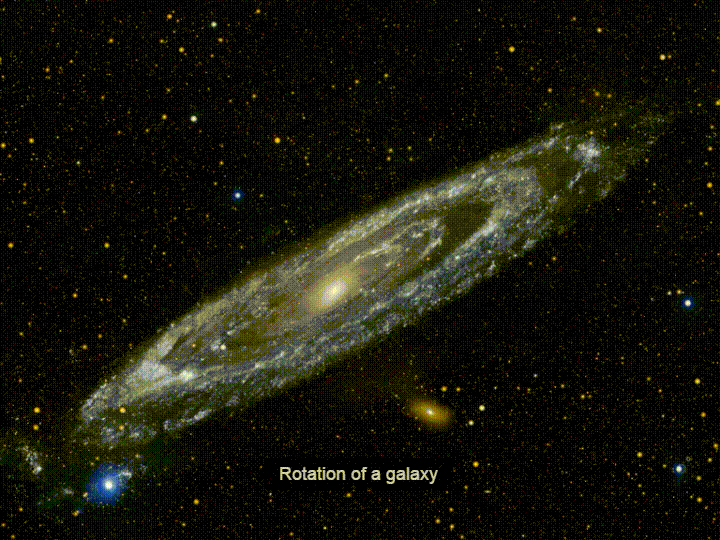

# Corotation

This project is a joint effort of Artur Prado and Lucas Amorim to demonstrate how
we can use Python to help Astronomers find life outside Earth.

It will be presented at The Conf 2019, on 17th august, and videos and slides
will be found at [my personal website](http://arturprado.com) as soon as they go
live.

For now, you can found a Jupyter Notebook with an animation that will be used to
explain the core concepts behind the idea and two videos with the animations
generated by the notebooks.

